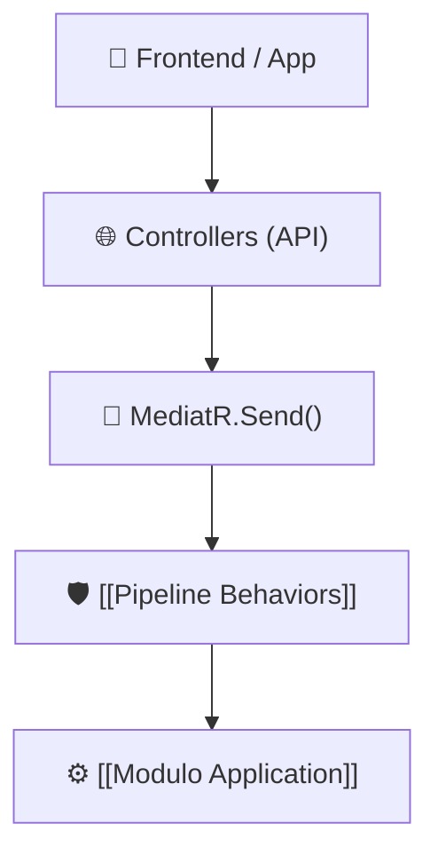

# 🌐 Módulo API (`Slotify.API`)

El proyecto **`Slotify.API`** es la capa de presentación externa y punto de entrada para todas las aplicaciones cliente (App Móvil en Expo / React Native, Web Admin, Postman).

---

## 🎯 Responsabilidades del Módulo
1. **Exponer Endpoints RESTful:** Definir rutas HTTP, códigos de estado y serialización JSON.
2. **Despachar Peticiones:** Recibir solicitudes y delegarlas al [[Modulo Application]] a través de **MediatR**.
3. **Seguridad y JWT:** Validar tokens de autenticación Bearer mediante middleware.
4. **Carga de Configuración:** Cargar variables de entorno desde `.env` y `appsettings.json`.
5. **Observabilidad:** Logging centralizado con Serilog y documentación interactiva OpenAPI.

---

## 🗂️ Controladores Principales
* **`AuthController`:** Endpoints para sincronización y autenticación (`POST /api/auth/sync`). Conecta con [[Feature Auth]].
* **`ScheduleBlocksController`:** Endpoints para bloqueos de horario (`GET`, `POST`, `DELETE /api/schedule-blocks`). Conecta con [[Feature ScheduleBlocks]].
* **`CalendarController`:** Endpoints para cálculo de disponibilidad (`GET /api/calendar/slots`). Conecta con [[Feature Calendar]].
* **`SectorTemplatesController`:** Endpoints para plantillas de negocio (`GET /api/sector-templates`). Conecta con [[Feature SectorTemplates]].

---

## 🔗 Relaciones en el Grafo
- **Depende de:** [[Modulo Application]], [[Modulo Infrastructure]], [[Pipeline Behaviors]]
- **Flujos relacionados:** [[Flujo General de Peticion]], [[Flujo de Registro y Sync Auth]], [[Flujo de Bloqueo de Horarios]]
- **Configuración de arranque:** `Program.cs`, `EnvLoader.cs`

