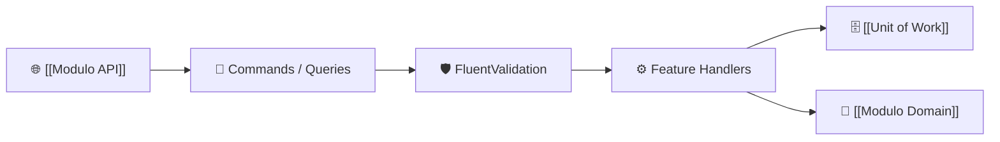

# ⚙️ Módulo Application (`Slotify.Application`)

La capa **`Slotify.Application`** contiene la **lógica de negocio y casos de uso** del sistema. No conoce detalles sobre controladores HTTP ni sobre Entity Framework Core directo, garantizando un código desacoplado y altamente testeable.

---

## 🎯 Responsabilidades del Módulo
1. **Patrón CQRS (Command Query Responsibility Segregation):**
   - **Commands (Escritura):** Modifican el estado del sistema (`RegisterAdminCommand`, `CreateScheduleBlockCommand`, `DeleteScheduleBlockCommand`).
   - **Queries (Lectura):** Consultan datos sin alterar el estado (`GetScheduleBlocksQuery`, `GetCalendarSlotsQuery`, `GetSectorTemplatesQuery`).
2. **Handlers de MediatR:** Cada caso de uso tiene su propio *Handler* con una única responsabilidad.
3. **Validación de Entrada:** Validadores automáticos construidos con **FluentValidation**.
4. **Transformación de Datos (DTOs):** Mapeo de entidades de dominio hacia objetos de transferencia seguros.

---

## 🧩 Submódulos Funcionales
* [[Feature Auth]]: Registro y gestión de administradores.
* [[Feature ScheduleBlocks]]: Gestión de bloqueos de agenda.
* [[Feature Calendar]]: Consultas de disponibilidad de turnos.
* [[Feature SectorTemplates]]: Consulta de plantillas comerciales.

---

## 🔗 Relaciones en el Grafo
- **Depende de:** [[Modulo Domain]]
- **Es consumido por:** [[Modulo API]]
- **Utiliza abstracciones de:** [[Unit of Work]], [[Repositorios]]
- **Flujos:** [[Flujo General de Peticion]], [[Flujo de Bloqueo de Horarios]], [[Flujo de Registro y Sync Auth]]

