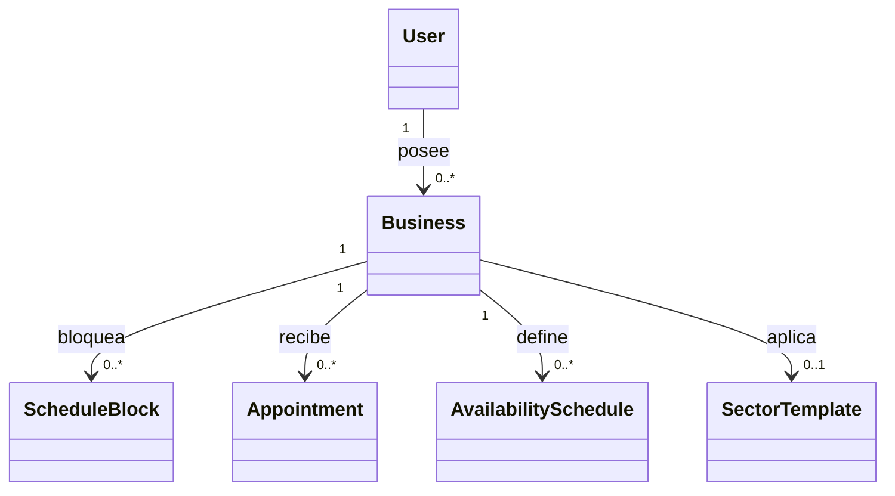

# 💎 Módulo Domain (`Slotify.Domain`)

El proyecto **`Slotify.Domain`** es el **corazón del negocio** y la capa más interna de Clean Architecture. No tiene ninguna dependencia de paquetes de terceros ni de frameworks de persistencia.

---

## 🎯 Responsabilidades del Módulo
1. **Entidades del Negocio:** Modelar los conceptos fundamentales del sistema de reservas y citas.
2. **Entidades Base y Auditoría:** Proporcionar clases base (`BaseEntity<T>`, `AuditableEntity`) para control de IDs, fecha de creación (`CreatedAt`) y modificación (`UpdatedAt`).
3. **Contratos de Persistencia (Interfaces):** Declarar las interfaces de repositorios que la infraestructura debe implementar.

---

## 🧱 Entidades Principales
* [[Entidad User]]: Usuarios, roles (`DUENO`, `EMPLEADO`, `CLIENTE`) y estados.
* [[Entidad Business]]: Negocio o sucursal donde se gestionan los turnos.
* [[Entidad ScheduleBlock]]: Bloqueos manuales de disponibilidad.
* [[Entidad Appointment]]: Citas reservadas por clientes.
* [[Entidad AvailabilitySchedule]]: Horarios regulares de apertura y atención.
* [[Entidad SectorTemplate]]: Plantillas base por industria.

---

## 📐 Interfaces de Repositorio Declaradas
* `IUserRepository` | `IBusinessRepository`
* `IScheduleBlockRepository` | `IAppointmentRepository`
* `IAvailabilityScheduleRepository` | `ISectorTemplateRepository`
* `IUnitOfWork` (Coordinador de persistencia)

---

## 🔗 Relaciones en el Grafo
- **Dependencias:** Ninguna (Cero dependencias externas).
- **Es referenciado por:** [[Modulo Application]], [[Modulo Infrastructure]], [[AppDbContext]]

