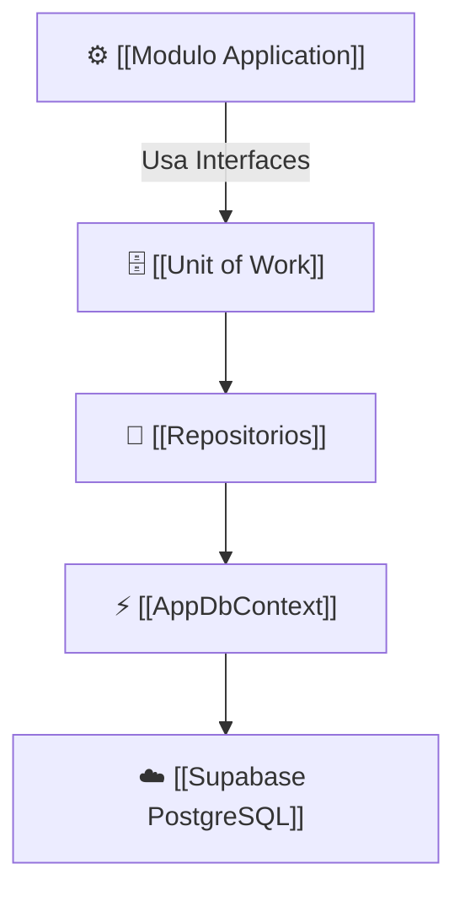

# 🗄️ Módulo Infrastructure (`Slotify.Infrastructure`)

El proyecto **`Slotify.Infrastructure`** implementa los detalles técnicos del sistema: acceso a la base de datos PostgreSQL en Supabase, configuración de Entity Framework Core y servicios externos.

---

## 🎯 Responsabilidades del Módulo
1. **Configuración de EF Core:** `AppDbContext` para gestionar conexiones, mapeos y cambios de entidades.
2. **Mapeo Relacional (Fluent API):** Clases de configuración en `Data/Configurations/` que definen tipos de datos, índices y claves foráneas.
3. **Implementación de Repositorios:** Clases concretas que ejecutan consultas LINQ optimizadas y operaciones CRUD.
4. **Auditoría Automática:** Interceptar el guardado (`SaveChangesAsync`) para asignar `CreatedAt` y `UpdatedAt` en tiempo UTC.
5. **Implementación del Unit of Work:** Coordinar transacciones y guardar cambios de forma atómica.

---

## 📂 Componentes Clave
* [[AppDbContext]]: El contexto central de Entity Framework Core.
* [[Unit of Work]]: Implementación de `IUnitOfWork`.
* [[Repositorios]]: Implementaciones de `ScheduleBlockRepository`, `AppointmentRepository`, `UserRepository`, etc.
* [[Supabase PostgreSQL]]: Conexión de base de datos en la nube.

---

## 🔗 Relaciones en el Grafo
- **Implementa interfaces de:** [[Modulo Domain]]
- **Es consumido por:** [[Modulo Application]] (a través de inyección de dependencias) y registrado en [[Modulo API]].
- **Persiste en:** [[Supabase PostgreSQL]]

