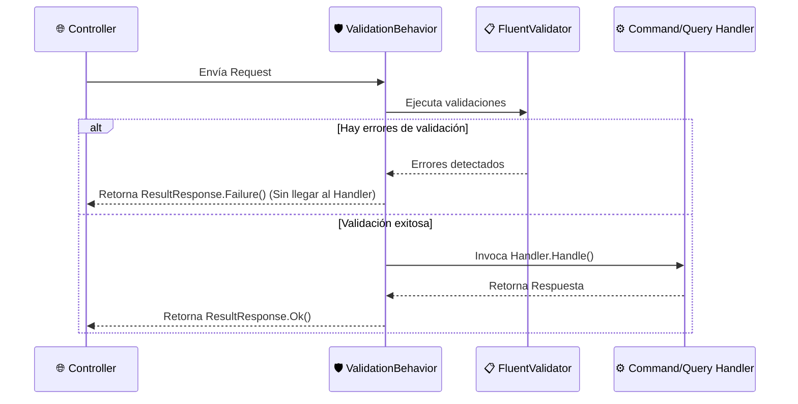

# 🛡️ Pipeline Behaviors de MediatR

Los **Pipeline Behaviors** son interceptores de tipo *Middleware* que envuelven la ejecución de cada comando y query en el [[Modulo Application]].

---

## ⚡ 1. `ValidationBehavior<TRequest, TResponse>`

Antes de que un Handler se ejecute, el `ValidationBehavior` busca si existe un validador registrado de **FluentValidation** para esa petición.

### Validadores Actuales:
* `RegisterAdminValidator`: Valida formato de email, nombres no vacíos y longitud.
* `CreateScheduleBlockValidator`: Valida que `StartDate < EndDate`, que el motivo no exceda 200 caracteres y que las fechas sean UTC.

---

## 🔗 Relaciones en el Grafo
- **Ubicación:** `Slotify.Application/Common/Behaviors/`
- **Conecta:** [[Modulo API]] ➡️ [[Modulo Application]] ➡️ [[Feature Auth]], [[Feature ScheduleBlocks]]
