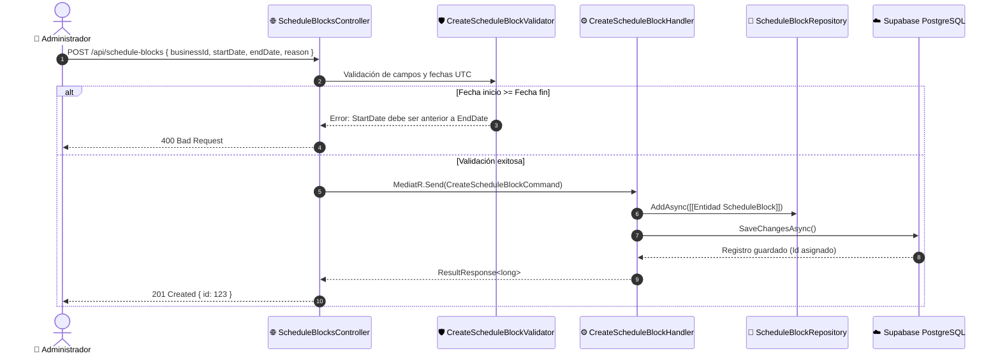

# 📅 Flujo de Bloqueo de Horarios (`ScheduleBlocks`)

Permite a un negocio bloquear franjas de tiempo para que ningún cliente pueda agendar citas en ese periodo.

---

## 🔄 Diagrama de Secuencia: Creación de Bloqueo

---

## 🔍 Consulta de Bloqueos (`GET /api/schedule-blocks`)

Cuando el calendario del negocio se abre:
1. El cliente envía `GET /api/schedule-blocks?startDate=...&endDate=...`.
2. `GetScheduleBlocksHandler` invoca `ScheduleBlockRepository.GetByDateRangeAsync()`.
3. Entity Framework consulta la tabla `ScheduleBlocks` filtrando por `StartDate >= @start AND EndDate <= @end`.
4. Se retornan los bloqueos mapeados a `ScheduleBlockDto`.

---

## 🔗 Componentes Relacionados
* [[Feature ScheduleBlocks]]
* [[Entidad ScheduleBlock]]
* [[Entidad Business]]
* [[Repositorios]]
