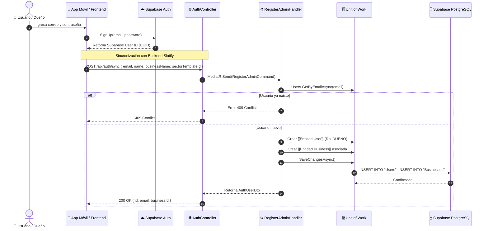

# 🔐 Flujo de Registro y Sincronización Auth

Este flujo describe cómo un usuario dueño de negocio se registra en el sistema, conectando la autenticación de **Supabase Auth** con el modelo relacional de **Slotify**.

---

## 🔄 Diagrama de Secuencia

---

## 🧩 Componentes que Intervienen
* **Controlador:** [[Modulo API]] (`AuthController.cs`)
* **Comando y Handler:** [[Feature Auth]] (`RegisterAdminCommand`, `RegisterAdminHandler`)
* **Entidades:** [[Entidad User]], [[Entidad Business]], [[Entidad SectorTemplate]]
* **Persistencia:** [[Unit of Work]], [[AppDbContext]], [[Supabase PostgreSQL]]
