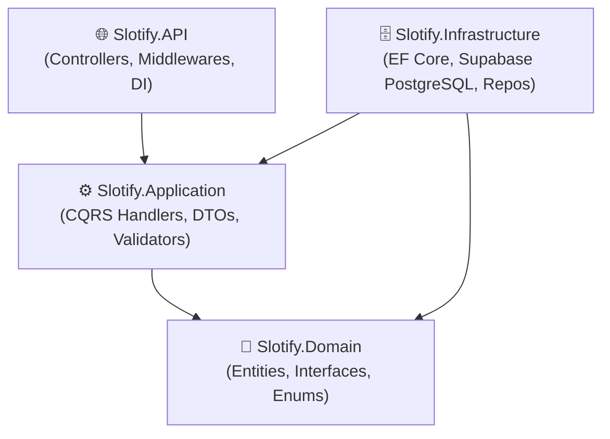
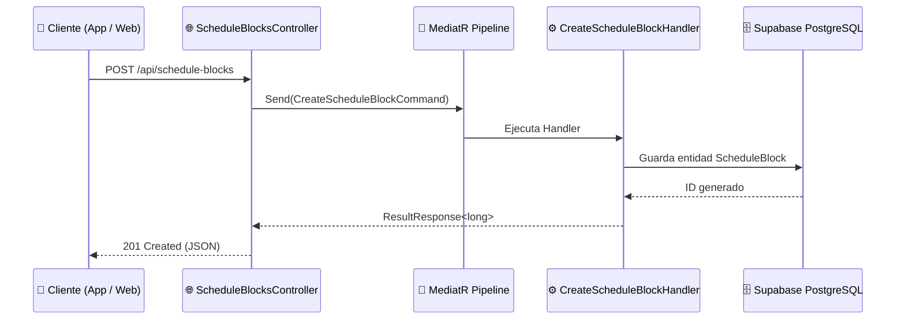

# 🏗️ Clean Architecture & Patrón CQRS

El backend de **Slotify** está construido sobre los principios de **Clean Architecture** (Arquitectura Limpia) y el patrón **CQRS** (Command Query Responsibility Segregation) utilizando **MediatR**.

---

## 📦 Descripción de Capas

### 1. `Slotify.Domain`
* El núcleo del sistema, **sin dependencias externas**.
* Contiene:
  * **Entidades:** `User`, `Business`, `ScheduleBlock`, `Appointment`, etc.
  * **Interfaces de Repositorios:** `IUserRepository`, `IScheduleBlockRepository`, `IUnitOfWork`.
  * **Entidades Base:** `BaseEntity`, `AuditableEntity`.

### 2. `Slotify.Application`
* Orquesta los casos de uso del negocio.
* Contiene:
  * **Comandos y Queries (CQRS):** Separación de operaciones de escritura y lectura.
  * **Handlers de MediatR:** Lógica de cada operación.
  * **Pipeline Behaviors:** Validación automática (`ValidationBehavior` con FluentValidation) y logging.

### 3. `Slotify.Infrastructure`
* Implementación de acceso a datos y servicios externos.
* Contiene:
  * **DbContext:** `AppDbContext` (Entity Framework Core con PostgreSQL / Supabase).
  * **Configuración Fluent API:** Mapeo de columnas, índices y restricciones en `Data/Configurations/`.
  * **Repositorios:** Implementación concreta de las interfaces del Dominio.

### 4. `Slotify.API`
* Punto de entrada HTTP (ASP.NET Core 9).
* Contiene:
  * **Controllers:** `AuthController`, `ScheduleBlocksController`, etc.
  * **Middlewares:** Manejo de excepciones, autenticación JWT Bearer, Serilog.
  * **Configuración:** `appsettings.json`, `Program.cs`.

---

## 🔄 Flujo de una Petición (Ejemplo: Bloqueo de Horario)

---

> [[Dashboard|⬅️ Volver al Dashboard]]
