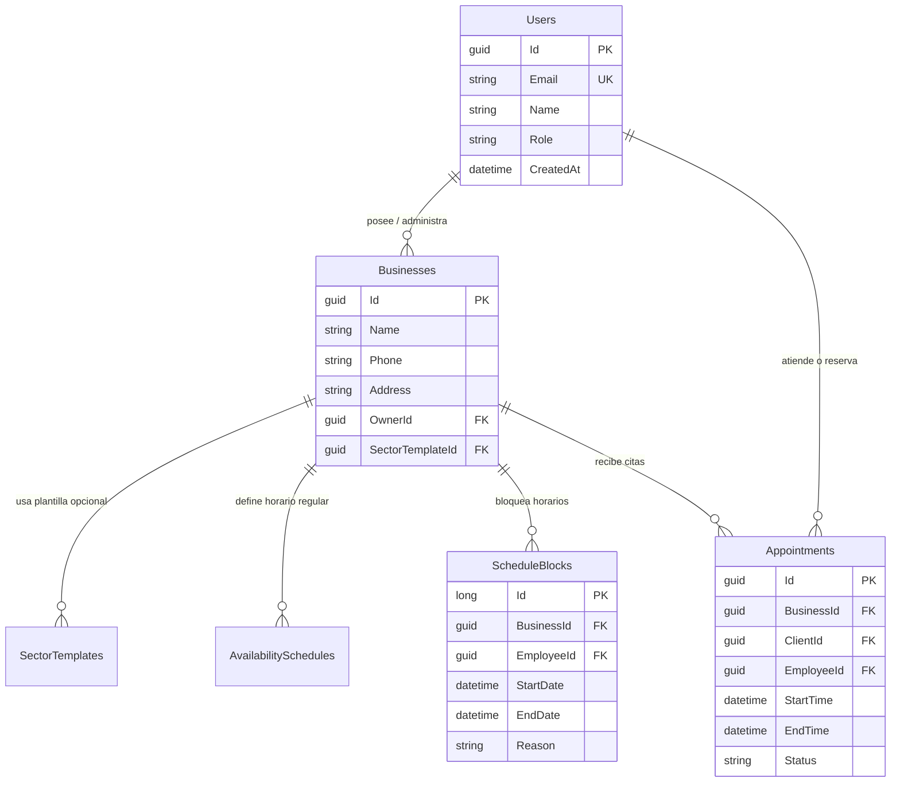

# 🗄️ Modelo de Datos (PostgreSQL / Supabase)

El backend utiliza **PostgreSQL** alojado en **Supabase** a través de **Entity Framework Core 9**.

---

## 📊 Diagrama Entidad - Relación (ERD)

---

## 🗃️ Tablas Principales

### 1. `Users`
Representa a los usuarios del sistema (Dueños de negocio, Empleados, Clientes).
* **ID:** `Guid` (Sincronizado con Supabase Auth).
* **Campos clave:** `Email`, `Name`, `Role` (`DUENO`, `EMPLEADO`, `CLIENTE`), `IsActive`.

### 2. `Businesses`
Representa el negocio o comercio que gestiona sus turnos/citas.
* **Campos clave:** `Name`, `Phone`, `Address`, `OwnerId` (FK a `Users`), `SectorTemplateId`.

### 3. `ScheduleBlocks`
Bloqueos de tiempo manuales donde no se pueden agendar citas (vacaciones, mantenimiento, descansos).
* **Campos clave:** `BusinessId`, `EmployeeId` (opcional), `StartDate` (UTC), `EndDate` (UTC), `Reason`.

### 4. `Appointments`
Citas y reservas generadas por o para los clientes.
* **Campos clave:** `BusinessId`, `ClientId`, `EmployeeId`, `StartTime`, `EndTime`, `Status`.

### 5. `SectorTemplates`
Plantillas preconfiguradas para rubros específicos (ej. Barberías, Clínicas, Salones).

---

> [!important] Fechas en PostgreSQL / Npgsql
> Todas las columnas de fecha con zona horaria (`timestamptz`) requieren que el valor en C# tenga `DateTimeKind.Utc` o formato ISO UTC (`...Z`).

---

> [[Dashboard|⬅️ Volver al Dashboard]]
