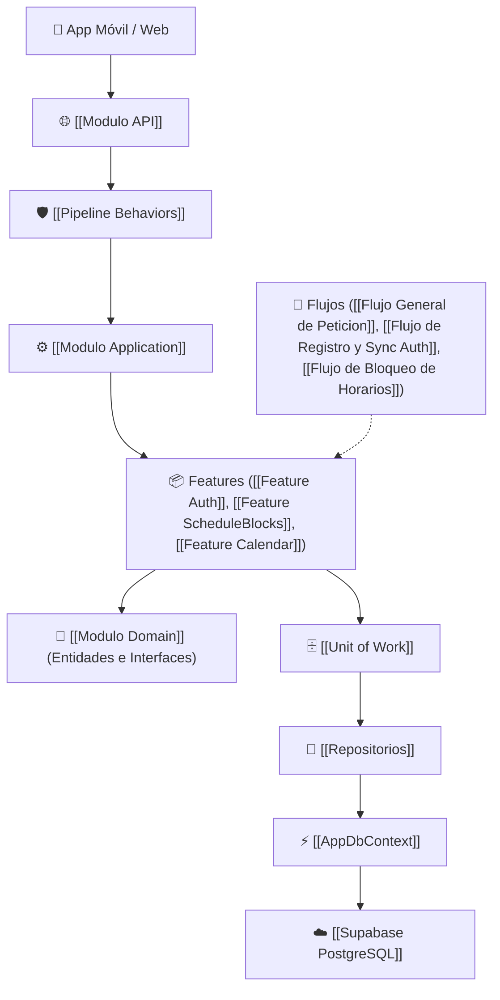

# 🌌 Slotify Backend - Knowledge Hub & Grafo de Conocimiento

Bienvenido a la documentación visual interactiva de **Slotify Backend**. Diseñada para navegarse en **Obsidian** y explorar la arquitectura en su **Vista de Grafo (`Ctrl + G`)**.

---

## 🗺️ Índice de Contenidos

### 🏛️ 1. [[Indice General|Índice General y MOC]]
Entrada principal a todas las secciones del sistema.

### 🧱 2. Arquitectura y Módulos
* [[Modulo API]]: Controladores, JWT, middlewares y endpoints HTTP.
* [[Modulo Application]]: Casos de uso, CQRS con MediatR, DTOs y validaciones.
* [[Modulo Domain]]: Núcleo de entidades e interfaces de repositorios.
* [[Modulo Infrastructure]]: EF Core 9, Supabase PostgreSQL, Unit of Work y mapeos.
* [[Pipeline Behaviors]]: Validación automática y logging transversal.

### 🌊 3. Flujos de Información (Ciclo de Vida)
* [[Flujo General de Peticion]]: El viaje completo de una petición HTTP desde la App hasta la BD.
* [[Flujo de Registro y Sync Auth]]: Integración entre Supabase Auth y la base de datos relacional.
* [[Flujo de Bloqueo de Horarios]]: Creación, consulta y eliminación de bloqueos de agenda.
* [[Flujo de Disponibilidad de Calendario]]: Cálculo de turnos y franjas disponibles.

### 📦 4. Features y Casos de Uso
* [[Feature Auth]] | [[Feature ScheduleBlocks]] | [[Feature Calendar]] | [[Feature SectorTemplates]]

### 💎 5. Entidades de Negocio
* [[Entidad User]] | [[Entidad Business]] | [[Entidad ScheduleBlock]]
* [[Entidad Appointment]] | [[Entidad AvailabilitySchedule]] | [[Entidad SectorTemplate]]

### 🗄️ 6. Persistencia y Base de Datos
* [[AppDbContext]] | [[Unit of Work]] | [[Repositorios]] | [[Supabase PostgreSQL]]

---

## 🧭 Grafo Conceptual de Interacción

